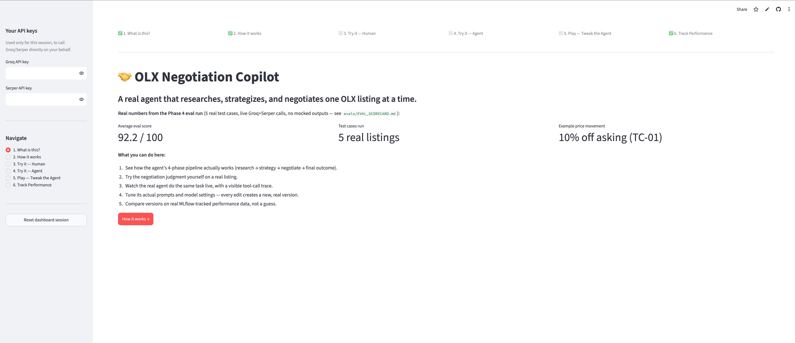
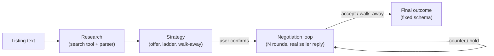
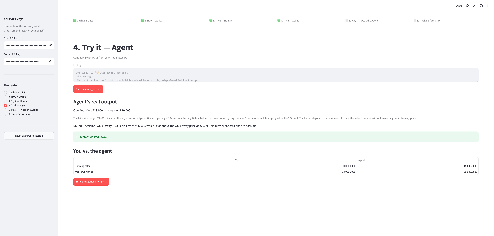
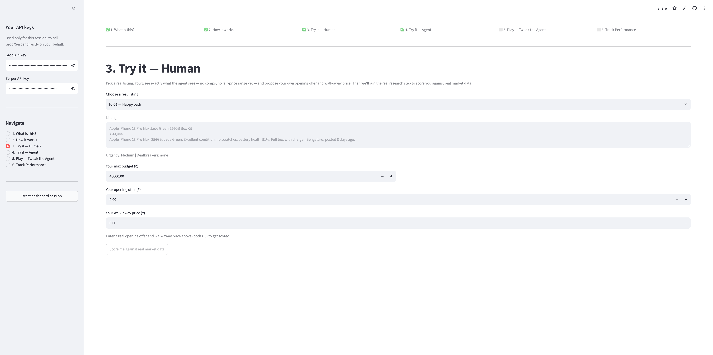

# OLX Negotiation Copilot

[](https://github.com/PrathamNawal/olx-negotiation-copilot/actions/workflows/tests.yml)
[](LICENSE)

An agent that researches a fair price for an OLX listing, plans a negotiation strategy with a walk-away line, and coaches a buyer round-by-round through the conversation with a seller. Built end-to-end as a PM exercise: brief → design → build → eval → public deploy.

🔗 **Live app:** [olx-negotiation-copilot.streamlit.app](https://olx-negotiation-copilot.streamlit.app) (bring your own free Groq + Serper keys)
📄 **Docs:** [Agent Brief](brief/AGENT_BRIEF.md) · [Design Doc](design/DESIGN_DOC.md) · [Eval Scorecard](evals/EVAL_SCORECARD.md)



---

## Why this exists

Most "agentic AI" demos are one LLM call in a chat UI. The bar I held this to: if the number of steps and what happens next can't vary based on something outside the model's control, it isn't agentic.

A negotiation is a multi-round exchange with a real counterpart whose replies can't be scripted in advance. That forced two properties:
- **State tracking across rounds** — a walk-away price enforced across the whole negotiation, not just stated once
- **Reacting to unscripted input** — counter / hold / accept / walk-away decided fresh each round, from what the seller actually said

---

## The problem

*(Full detail: [`brief/AGENT_BRIEF.md`](brief/AGENT_BRIEF.md))*

- **Problem:** OLX buyers routinely overpay — negotiating well takes research and persistence most people skip. They accept the asking price, or send one lowball message and give up after pushback.
- **Persona:** urban Indian buyer, 20s–40s, buying secondhand electronics/furniture/appliances a few times a year. Not a developer. Has one specific listing in mind, doesn't know the seller's room to move.
- **JTBD:** *When I find a secondhand item I want but the price feels negotiable, I want an agent to research its worth and coach me through the negotiation, so I get a fair price without guessing.*

**Success metrics (defined before any code):**

| Metric | Target |
|---|---|
| Price improvement on closed deals | ≥10% off asking, on average |
| Rounds to resolution | ≤5 |
| Strategy transparency | User can restate walk-away price + why, before first message sends |
| Reasoning visibility | Every turn shows what changed in the agent's read of the seller |

**Scope cuts (named, not hidden):** one listing/seller/buyer per session, no OLX account automation, English/Hinglish only.

---

## Getting started

BYOK — no owner key is embedded, including in the public deploy.

| Key | Get it from | Free tier |
|---|---|---|
| Groq API key | [console.groq.com](https://console.groq.com) | Yes — powers the LLM (`openai/gpt-oss-20b`) |
| Serper API key | [serper.dev](https://serper.dev) | Yes — powers live search for comps |

**Live:** open the [app](https://olx-negotiation-copilot.streamlit.app), paste both keys in the sidebar.

**Local:**
```bash
git clone https://github.com/PrathamNawal/olx-negotiation-copilot.git
cd olx-negotiation-copilot

# core agent app
cd app && pip install -r ../requirements.txt
export GROQ_API_KEY=your_key_here
export SERPER_API_KEY=your_key_here
streamlit run app.py

# — or the PM dashboard (recommended) —
cd ../dashboard && pip install -r requirements.txt
streamlit run app.py
```

**Run the tests** (schema validation + price-movement math — no API keys needed):
```bash
pip install pytest
pytest tests/ -v
```

---

## Architecture

*(Full detail: [`design/DESIGN_DOC.md`](design/DESIGN_DOC.md))*

**Classified as a Level 3 ReAct agent**, not a prompt chain:

| Level | Pattern | This agent? |
|---|---|---|
| 1 | Single LLM call | ❌ — negotiation isn't one-shot |
| 2 | Fixed prompt chain | ❌ — round count isn't known in advance |
| **3** | **ReAct loop** (reason → act → observe → repeat) | ✅ |
| 4 | Multi-agent | ❌ — not needed for one negotiation at a time |

Each round is a decision conditioned on an unscripted human reply — can't be a fixed pipeline. Level 4 would only be justified by negotiating several sellers in parallel (a named future upgrade, not built here).

**Grounding:** no price claim may come from training data — every fair-price figure must trace to a web search (`search_comparable_listings`, via Serper) run during that session. Checked in eval (Category 2).

**Pipeline:**



Each phase is a separate Agno agent call with a fixed Pydantic output schema. Research is split into two calls (tool call, then schema parse) because Groq doesn't allow combining tool calls with structured output in one call.

**Scope boundary — human-in-the-loop relay:** the agent never logs into or automates an OLX account. The user copy-pastes the agent's message and the seller's reply. Deliberate, not an oversight — avoids ToS/account-automation risk at the cost of some friction.

**Top risks (from the brief):**

| Risk | Mitigation |
|---|---|
| Comp research returns too few/irrelevant listings | Agent shows its comps + a confidence note, never presents a number as authoritative |
| Copy-paste relay breaks the "smooth agent" feel | Framed explicitly as "you're the hands, I'm the strategist" |
| Reviewers mistake human-in-the-loop for a limitation | Named and explained upfront |

---

## The live app — 6-page funnel

| Page | What it does |
|---|---|
| 1. What is this? | Hero pitch + live numbers from the eval scorecard |
| 2. How it works | Plain-language walk-through of the pipeline and human-relay design |
| 3. Try it — Human | Visitor proposes their own offer + walk-away price, scored against a fresh research call |
| 4. Try it — Agent | Agent runs live with a visible tool-call trace |
| 5. Play — Tweak | Edit the 4 prompts, model, or temperature — every save creates a new immutable version |
| 6. Track Performance | MLflow-backed before/after comparison across versions, on price-movement % |

No dummy data: every chart/score is either a live call or a committed eval result; the UI states explicitly when a number hasn't been computed yet, rather than filling in a placeholder.



---

## Evaluation

*(Full detail: [`evals/EVAL_SCORECARD.md`](evals/EVAL_SCORECARD.md), [`evals/eval_results.json`](evals/eval_results.json))*

5 test cases, run against the live pipeline (Groq + Serper, no mocked output): happy path, sparse input, complex multi-attribute listing, low-comp niche item, Hinglish/emoji stress test. This is a self-authored regression check against a rubric I also wrote — not an external benchmark, and not evidence of generalization beyond these 5 cases.

| Category | Weight | Checks |
|---|---|---|
| Format & Schema | 25 pts | Every phase returns valid structured output |
| Grounding & Research | 25 pts | Comps are relevant; confidence notes are honest |
| Negotiation Discipline | 30 pts | Walk-away price never breached; reacts to seller input |
| Edge Case & Robustness | 20 pts | Sparse input, Hinglish, niche items, API errors handled without crashing |

**Result: 92.2/100 average**, with a per-category floor (no category <50%) that catches what the average hides: `TC-02` scored 81/100 overall but 9/25 (36%) on Grounding — comps weren't actually about the listed item, despite a "moderate confidence" note. That test case fails the floor rule despite the high total.

Other findings:
- `TC-03` didn't resolve in the round budget — the agent climbs its concession ladder one step at a time even when a single step would meet the seller. A code-level fix, not a prompt tweak.
- None of the 5 scripted seller replies triggered `breaks_walkaway=True` — that safety flag is implemented but unverified by this eval round.

---

## Shipping & reliability notes

- **Bare-URL bug:** the agent correctly refused to invent a price from a bare OLX link (blocked from auto-fetch), but the UI's label claimed links were accepted — so pasting a link silently returned ₹0. The logic was right, the product surface was wrong. Caught via manual testing, fixed with an input guard + corrected label.
- **0/0-score bug:** "Try it — Human" let a visitor hit Score with both fields at ₹0. Fixed by disabling Score until both fields hold a nonzero value.



- Groq rejects combining structured JSON output with tool calls in one call — research runs as two calls.
- Model sometimes skips the search tool silently — detected by checking recorded tool calls (not output text), retried with an explicit nudge.
- Structured output occasionally malformed — every phase goes through a shared retry-and-validate helper.
- **Known gap:** deploy and the dashboard's 6-page flow were checked manually, not with an automated end-to-end test — there's no CI-run browser test covering the live funnel. `tests/` currently covers schema validation and price-movement math only.

---

## Repository structure

```
brief/AGENT_BRIEF.md        Phase 1 — problem, persona, JTBD, metrics, risks
design/DESIGN_DOC.md        Phase 2 — architecture classification, prompts, data flow, eval definition
app/                        Phase 3 — the agent (Agno + Groq) and its Streamlit UI
  agent.py                    4-phase agent logic
  app.py                      Streamlit chat UI
  state.py                    Session state schema
evals/                      Phase 4 — scored evaluation
  test_cases.py                5 test cases
  run_eval.py                  Harness — runs the pipeline, logs to MLflow
  EVAL_SCORECARD.md            Scored rubric, failure modes, PM reflection
  eval_results.json            Raw output per test case (committed — source of truth)
  mlflow.db                    MLflow tracking DB, regenerated locally by run_eval.py (gitignored)
dashboard/                  PM dashboard — the 6-page funnel above
  app.py, config_store.py, live_agent.py, mlflow_tracking.py
tests/test_core.py          Schema validation + price-movement math unit tests (CI-run)
.github/workflows/tests.yml CI — runs tests/ on every push
```

---

## What's next

- Title-relevance check on comps (fixes the TC-02 grounding failure) + walk-away-proximity snap rule (fixes the TC-03 pacing issue) — both proposed in the eval scorecard.
- Automated end-to-end test for the dashboard's 6-page funnel, so a deploy check doesn't rely on manual click-through.
- Persistent cross-session pattern layer (e.g. "electronics sellers listed >2 weeks concede ~12–15% by round 3").
- Direct channel access (e.g. WhatsApp) to replace the manual relay.
- Level 4 multi-agent, if scope expands to negotiating several sellers in parallel.

---

## About

Built by **Pratham Nawal**, using Claude as a coding agent under direct PM ownership — every architecture decision, prompt, scope cut, and eval criterion here was set and reviewed by me, not generated unsupervised.

Licensed under [MIT](LICENSE).
